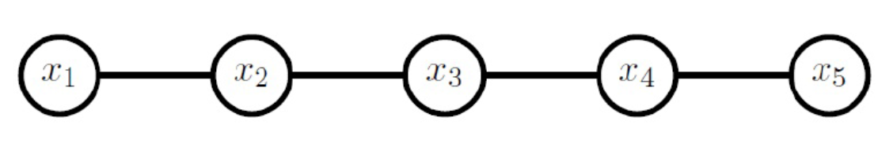
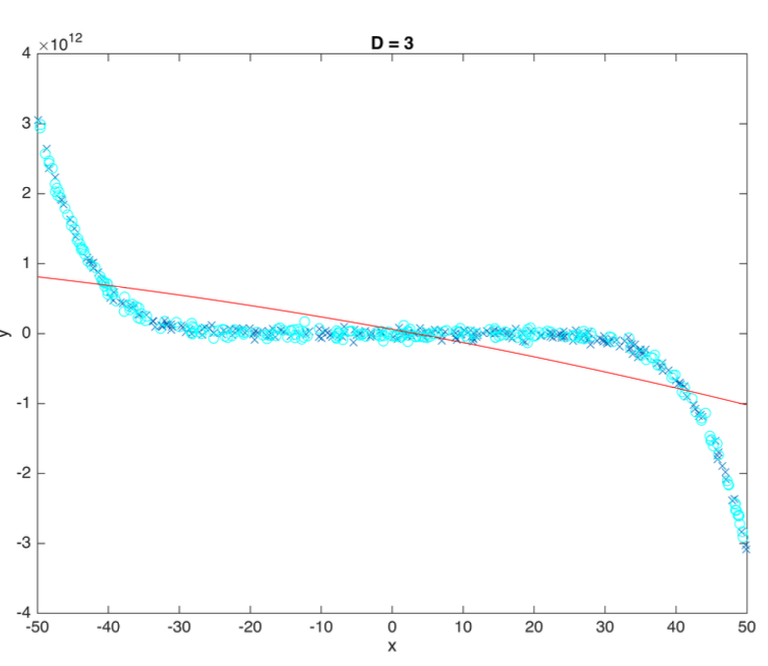
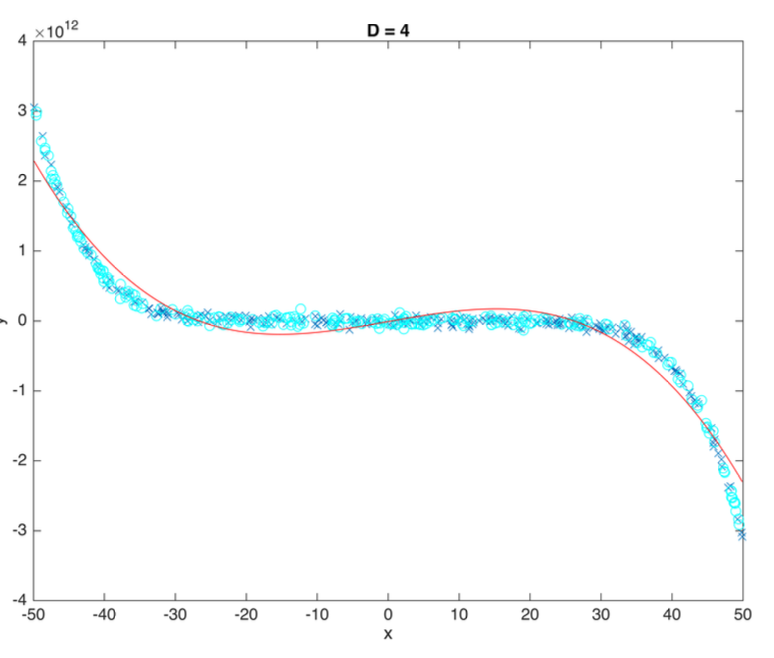
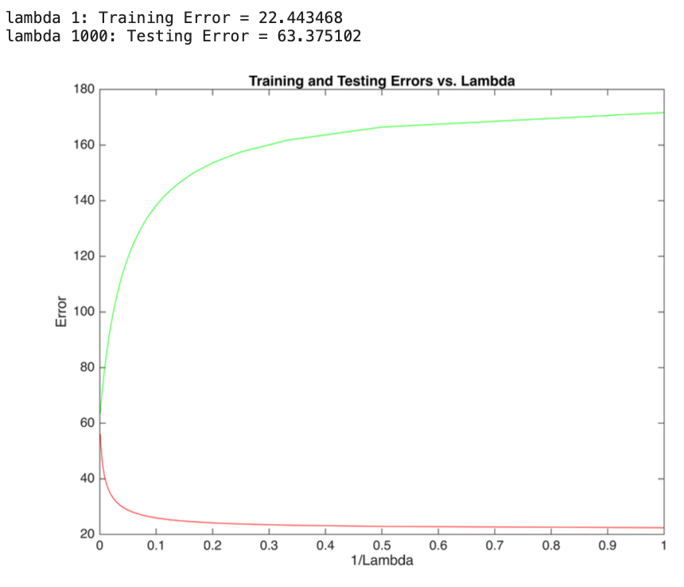
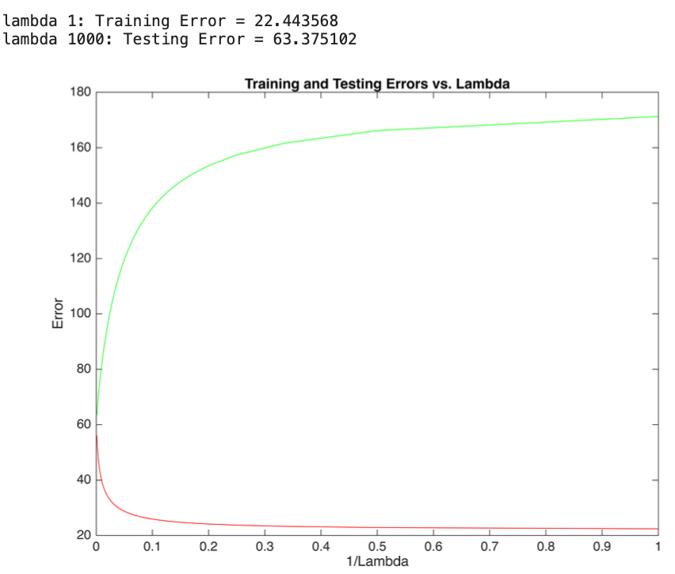

# Machine Learning Projects
Projects from the Machine Learning course, covering key algorithms and techniques such as linear perceptron, Support Vector Machines (SVM), Principal Component Analysis (PCA), Junction Tree, Polynomial Regression, and Logistic Regression.

##  1- Junction Tree algorithm (JTA) for a Markov chain with binary variables

We have a Markov chain as below:

The probability distribution implied by this undirected graph is: p(x1, ..., x5) = 1/Z ψ(x1,x2)ψ(x2,x3)ψ(x3,x4)ψ(x4,x5). In this project we write an implementation of the junction tree algorithm that computes all the pairwise marginals p(xi, xi+1) for such a Markov chain for any number of variables n and any initialization of the clique potential functions.

### Input

- **n**: The number of binary variables in the Markov chain.
- **potentials**: A cell array of size `n−1`, where each cell contains a `2x2` matrix representing the potential function of the corresponding edge in the chain.

### Output

- A cell array of size `n−1`, where each cell contains the marginal probability distribution for the corresponding pair of variables.

### Steps Implemented

1. **Initialization**: 
   - Create a matrix to store the messages passed between cliques in the Markov chain.

2. **Left-to-Right Message Passing**:
   - Compute messages from each clique to the next clique in the chain. This involves sequentially passing information from the leftmost variable to the rightmost variable, using the potential functions provided.

3. **Right-to-Left Message Passing**:
   - Compute messages from each clique to the previous clique in the chain. This step involves propagating information in the reverse direction, from the rightmost variable back to the leftmost variable.

4. **Marginal Computation**:
   - Calculate the pairwise marginal probability distributions for each pair of variables based on the messages obtained from the previous steps. This involves combining the messages to determine the probability distribution over the binary variables.
  
##  2- Polynomial Regression Models
In this project, we evaluated polynomial regression models with degrees ranging from 1 to 10. We calculated training errors for each polynomial degree and plotted these results to visualize performance. To ensure robustness, we implemented 2-fold cross-validation by shuffling the data, splitting it into training and testing sets, and computing testing errors for each degree. The best model was selected based on the polynomial degree that achieved the lowest testing error.

We observe how increasing the degree impacts the model's performanc. We can see the change in risk when moving from a polynomial degree of 3 to 4:

For D = 3:

For D = 4:

## 3- Regularized Linear Regression

In this project, we implement ridge regression using two methods:

1. **Direct Computation**: We calculate the model parameters using the closed-form solution and assess training and testing errors.
2. **Gradient Descent**: We optimize model parameters through gradient descent and evaluate training and testing errors.

**Regularization Parameter (λ) Analysis**:

- We analyze the effect of various λ values on training and testing errors.

For the firat function, after iterating for different values of Lambda, we calculate the train and test loss for each, and plot the risk regarding to Lambda:

We do the same thing for the second function:

After visualizing the models, we see that we get the same results. The train error decreases and the test error increases as the value of Lambda decreases.
